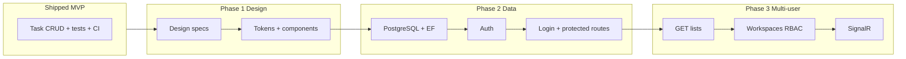

# Todo — Product & Engineering Roadmap

React frontend (`Todo.Web`) + ASP.NET API (`Todo.Api`). The single-user MVP is **shipped**: full task CRUD, polished presentation, error handling, design tokens (v1), automated tests, CI, and staging deploy.

This document covers **what comes next** — product expansion, design system maturity, data platform, and multi-user collaboration.

---

## Shipped baseline (do not re-plan)

| Area | Status |
|------|--------|
| Scaffold, dev proxy, lint/format, feature-folder structure | ✅ |
| API client + lists/tasks endpoints | ✅ |
| Home → create list → list page with tasks | ✅ |
| Task CRUD (create, read, update status, delete) | ✅ |
| Priority/status badges, due-date formatting, overdue styling | ✅ |
| Error boundary, inline errors, responsive layout, keyboard/focus | ✅ |
| Design tokens v1 (CSS variables, light mode) | ✅ |
| `useAsync`, centralized enums, `getErrorMessage`, ADR on type safety | ✅ |
| Vitest + RTL unit/component tests, Playwright E2E, GitHub Actions CI | ✅ |
| Staging deploy (GitHub Pages + `VITE_API_BASE_URL`) | ✅ |

**Backend today:** JSON file persistence (`JsonListRepository`, `JsonTaskRepository`). `User` entity exists in domain but is not wired to storage or auth. No `GET /api/lists` (list-all) endpoint.

---

## Planning assumptions

| Item | Value |
|------|-------|
| Sprint length | 2 weeks |
| Definition of Done | Code reviewed; ESLint + Prettier clean; `npm run build` + tests pass; WCAG 2.1 AA on touched UI; manual verification against running API; PR merged |
| Ticket prefix | `FE-` frontend, `BE-` backend, `DS-` design, `PM-` product |
| Out of scope (for now) | Native mobile apps, billing/monetization, offline/PWA |

---

## Product vision

A **fast, trustworthy task workspace** for individuals and teams — not another bloated project-management suite. Differentiators to protect as we grow:

1. **Speed to value** — create a list and add a task in under 10 seconds.
2. **Clarity** — tasks read at a glance; status and priority are obvious without training.
3. **Trust** — real accounts, durable data, and predictable permissions before we add collaboration bells and whistles.

---

## Phase 1 — Design system & visual polish

**Goal:** Move from "functional MVP" to a cohesive product surface. Design leads; engineering implements tokens and components.

### Design team deliverables (Sprint A — week 1)

Design owns these artifacts before engineering starts component work. Store in `Todo.Web/docs/design/` (Figma link + exported specs).

| ID | Deliverable | Contents |
|----|-------------|----------|
| DS-1 | **Brand & color palette** | Primary, secondary, neutral scale (50–900), semantic colors (success, warning, danger, info), surface/background hierarchy, contrast ratios ≥ 4.5:1 for body text |
| DS-2 | **Typography system** | Font stack (or licensed family), type scale (display → caption), weight rules, line-height per size |
| DS-3 | **Spacing & layout grid** | 4px or 8px base grid; page max-widths; sidebar width; breakpoints (mobile 375, tablet 768, desktop 1024+) |
| DS-4 | **Elevation & borders** | Shadow levels (0–3), border radii, divider usage |
| DS-5 | **Component specs** | Button (primary/secondary/ghost/danger, sizes), Input, Select, Textarea, Badge, Card, Empty state, Skeleton, Toast/alert, Modal/confirm dialog, Sidebar nav item |
| DS-6 | **Iconography** | Icon set choice (e.g. Lucide/Heroicons), size grid (16/20/24), usage rules |
| DS-7 | **Motion** | Transition durations (fast 150ms, normal 250ms), easing curves; when *not* to animate (respect `prefers-reduced-motion`) |

**Design principles (proposed — design to ratify):**

- **Calm density** — enough information to act, not a spreadsheet.
- **Status at a glance** — color is supplementary; labels always present.
- **One primary action per view** — e.g. "Add task" on list page.

### Engineering sprints (Sprint B–C)

| ID | Type | Title | Pts | Acceptance criteria |
|----|------|-------|-----|---------------------|
| FE-25 | Story | Design tokens v2 | 5 | Replace ad-hoc colors in CSS with semantic tokens from DS-1/DS-2 (`--color-text-primary`, `--color-surface-raised`, `--color-status-done`, etc.); document token map in `docs/design/tokens.md` |
| FE-26 | Story | Core component library | 8 | Shared `Button`, `Input`, `Select`, `Badge`, `Card` in `src/shared/components/ui/`; variants match DS-5; used in create-list, create-task, task item |
| FE-27 | Story | Layout shell refresh | 5 | `AppLayout` uses new nav patterns; list page header hierarchy per DS-3; sidebar placeholder region (empty until Phase 3) |
| FE-28 | Task | Confirm dialog component | 3 | Replace inline delete confirm with accessible `ConfirmDialog` (focus trap, Esc, `role="alertdialog"`) |
| FE-29 | Task | Empty & error state illustrations | 3 | Consistent empty/error panels using DS-5 empty-state pattern |
| FE-30 | Task | Dark mode (optional) | 5 | `[data-theme="dark"]` token set from DS-1; toggle in header; persists in `localStorage` |
| FE-31 | Task | Visual regression baseline | 3 | Playwright screenshot tests for home + list page at 375px and 1280px |

**Deliverable:** UI matches design system; new features must use shared components, not one-off styles.

---

## Phase 2 — Data platform: database + authentication

**Goal:** Replace JSON files with a real database; users sign in; every list/task is owned by an authenticated user. Prerequisite for multi-list navigation and collaboration.

### Why now

| Risk with JSON | Database + auth fixes |
|----------------|----------------------|
| No concurrency safety | Transactions, row-level locking |
| No query/filter at scale | Indexed queries, pagination |
| Dev `ownerId` hard-coded | Real identity on every row |
| Cannot deploy multi-instance API | Shared durable store |

### Architecture decisions (ADR required before Sprint D)

| Decision | Recommendation | Alternatives |
|----------|----------------|--------------|
| Database | **PostgreSQL** (or SQL Server if team is .NET/Azure-native) | SQLite (dev only), Cosmos DB |
| ORM | **EF Core 9** | Dapper |
| Auth | **ASP.NET Core Identity** + JWT bearer for SPA | Auth0, Entra ID |
| Password storage | Identity default (PBKDF2) | — |
| Session | Short-lived access JWT + refresh token in httpOnly cookie | Local storage (avoid) |

### Sprint D — Database foundation (backend)

| ID | Type | Title | Pts | Acceptance criteria |
|----|------|-------|-----|---------------------|
| BE-1 | Story | EF Core + PostgreSQL setup | 5 | `Todo.Infrastructure` DbContext; connection string via config/env; Docker Compose for local Postgres |
| BE-2 | Story | Schema: users, lists, tasks | 5 | Tables map to domain entities; `OwnerId` FK on lists; soft-delete columns preserved; indexes on `OwnerId`, `ListId` |
| BE-3 | Story | EF repository implementations | 8 | `EfListRepository`, `EfTaskRepository` implement existing interfaces; JSON repos removed from DI |
| BE-4 | Task | Data migration script | 5 | One-time import from `data/lists.json` + `data/tasks.json` into DB; idempotent; documented in README |
| BE-5 | Task | Repository integration tests | 5 | Testcontainers or in-memory provider; cover CRUD paths currently in `Json*RepositoryTests` |

### Sprint E — Authentication (backend + frontend)

| ID | Type | Title | Pts | Acceptance criteria |
|----|------|-------|-----|---------------------|
| BE-6 | Story | Identity + user store | 8 | Register, login, refresh, logout endpoints; `Users` table; password validation rules |
| BE-7 | Story | Protect API endpoints | 5 | All list/task routes require authenticated user; `ownerId` derived from JWT claims, not request body |
| BE-8 | Story | `GET /api/users/me` | 2 | Returns current user profile (id, name, email) |
| BE-9 | Task | CORS + cookie/JWT config | 3 | SPA origin allowed; refresh cookie secure/same-site in staging |
| FE-32 | Story | Auth pages (register, login) | 5 | Forms with validation; friendly error messages; redirect to intended route after login |
| FE-33 | Story | Auth context + protected routes | 5 | `AuthProvider`; unauthenticated users redirected to login; token refresh on 401 |
| FE-34 | Task | API client credentials | 3 | Attach bearer token to requests; refresh flow; remove dev `ownerId` from `shared/config/dev.js` |
| FE-35 | Task | Auth E2E smoke | 3 | Register → login → create list → add task in Playwright |

**Deliverable:** Data lives in PostgreSQL; users authenticate; JSON repos retired; staging uses managed DB.

### Security checklist (non-negotiable)

- [ ] Passwords hashed; never logged
- [ ] Rate limiting on login/register
- [ ] HTTPS only in staging/production
- [ ] No secrets in frontend bundle
- [ ] Authorization: user A cannot read/write user B's lists (integration test)

---

## Phase 3 — Multi-user product & collaboration

**Goal:** Transform from a single-list tool into a **workspace** where people manage multiple lists, share work, and stay in sync. Each sprint is independently shippable.

**Dependency:** Phase 2 complete (DB + auth).

---

### Sprint F — Multi-list navigation & home experience

**User problem:** "I have several lists but can only reach them if I bookmark URLs."

| ID | Type | Title | Pts | Acceptance criteria |
|----|------|-------|-----|---------------------|
| BE-10 | Story | `GET /api/lists` | 3 | Returns current user's non-deleted lists; sorted by `UpdatedAt` desc; pagination optional (limit/offset) |
| BE-11 | Task | List metadata on create | 2 | `UpdatedAt` maintained on list and task mutations |
| FE-36 | Story | Sidebar navigation | 8 | Persistent sidebar (collapsible on mobile); all lists listed; active list highlighted; create-list from sidebar |
| FE-37 | Story | Home page redesign | 5 | Authenticated home = dashboard: recent lists, quick-create, empty state for new users |
| FE-38 | Task | Deep-link preservation | 2 | `/lists/:id` still works; sidebar syncs selection |
| FE-39 | Task | List rename & delete | 5 | `PATCH /api/lists/:id`, `DELETE /api/lists/:id` (soft delete); UI in list header |

**Success metric:** Median time to switch lists < 2 seconds; ≥ 30% of active users create a second list within 7 days.

---

### Sprint G — Sharing & permissions (RBAC v1)

**User problem:** "I want to share a grocery list with my partner without sharing my work tasks."

| ID | Type | Title | Pts | Acceptance criteria |
|----|------|-------|-----|---------------------|
| BE-12 | Story | Workspace model | 8 | `Workspace`, `WorkspaceMember`, `Role` (Owner, Editor, Viewer); lists belong to a workspace |
| BE-13 | Story | Invite flow | 5 | Invite by email; pending invite token; accept/decline |
| BE-14 | Story | Authorization middleware | 5 | Every list/task operation checks workspace role; Viewer = read-only |
| FE-40 | Story | Share dialog | 5 | Invite by email; show current members + roles; revoke access |
| FE-41 | Story | Role-based UI | 5 | Hide write controls for Viewers; show "View only" badge |
| FE-42 | Task | Workspace switcher | 5 | Header dropdown: Personal / Shared workspaces |
| FE-43 | Task | Settings page | 3 | Profile (name), change password, sign out all sessions |

**Success metric:** Shared-list creation rate; invite acceptance rate > 50%.

---

### Sprint H — Real-time sync (SignalR)

**User problem:** "My teammate and I both edited the same list and didn't see each other's changes."

| ID | Type | Title | Pts | Acceptance criteria |
|----|------|-------|-----|---------------------|
| BE-15 | Spike | Conflict strategy ADR | 2 | Document: last-write-wins vs. operational transform; start with LWW + version column |
| BE-16 | Story | SignalR hub | 8 | Events: `TaskCreated`, `TaskUpdated`, `TaskDeleted`, `ListUpdated`; scoped to workspace/list groups |
| BE-17 | Task | Event emission in handlers | 5 | All mutating commands publish hub events after DB commit |
| FE-44 | Story | SignalR client hook | 5 | `useListSync(listId)` subscribes; reconnect with exponential backoff |
| FE-45 | Story | Live UI updates | 5 | Incoming events update task list without full refetch; optimistic UI reconciles on conflict |
| FE-46 | Task | Connection status indicator | 2 | Subtle "Live" / "Reconnecting…" in list header |

**Success metric:** < 2s perceived sync latency between two clients on same list.

---

### Sprint I — Notifications & activity

**User problem:** "I don't know what changed unless I'm staring at the list."

| ID | Type | Title | Pts | Acceptance criteria |
|----|------|-------|-----|---------------------|
| BE-18 | Story | Activity log | 5 | Append-only `Activity` table: actor, action, entity, timestamp |
| BE-19 | Story | In-app notifications API | 5 | `GET /api/notifications`; mark read; unread count |
| FE-47 | Story | Activity feed (list scope) | 5 | "Alex marked 'Buy milk' done" on list page |
| FE-48 | Story | Notification bell | 5 | Header bell + dropdown; badge count; link to relevant list/task |
| FE-49 | Spike | Email digest (optional) | 3 | Daily summary email — evaluate SendGrid/SES; defer if cost unclear |

---

### Sprint J — Productivity expansion (pick 2–3 per sprint)

Break into stories when sprint is committed.

| Theme | Ideas | Backend | Frontend |
|-------|-------|---------|----------|
| **Views** | Kanban board by status; calendar by due date | Filter/sort APIs | View toggle on list page |
| **Task depth** | Subtasks, task detail drawer, markdown description | `ParentTaskId`, PATCH task fields | Drawer UI, nested indent |
| **Organization** | Tags, filters, full-text search | Tags table; search index (PG `tsvector`) | Filter bar, search input |
| **Bulk** | Multi-select, bulk status/delete | Batch endpoints | Checkbox selection mode |
| **Templates** | "Weekly review", "Sprint planning" list templates | Template seed entities | Template picker on create |
| **Recurring** | Repeating tasks (daily/weekly) | Recurrence rule on task | Create-form recurrence picker |

---

## Product backlog — strategic bets (PM research)

Ideas ranked by **impact × feasibility** for a task product competing with Todoist, Things, and Linear (lightweight tier). Not committed — groom quarterly.

### Tier 1 — High impact, fits core loop

| Idea | User value | Hypothesis | Effort |
|------|------------|------------|--------|
| **Smart quick-add** | Parse "Buy milk tomorrow p1" into fields | Reduces friction for power users | M |
| **Today / Upcoming views** | Cross-list aggregation by due date | Users think in time, not just lists | M |
| **Keyboard shortcuts** | `n` new task, `j/k` navigate, `/` search | Retention for daily drivers | S |
| **Undo** | Recover accidental delete for 5s | Trust signal | S |
| **Drag-and-drop reorder** | Manual priority within a list | Expected in modern task UIs | M |

### Tier 2 — Differentiation & team value

| Idea | User value | Hypothesis | Effort |
|------|------------|------------|--------|
| **Focus mode** | Show one task at a time; hide noise | Helps ADHD/focus use cases | M |
| **AI task breakdown** | "Plan a birthday party" → suggested subtasks | LLM-assisted onboarding spike | L |
| **Integrations** | Slack notify on assign/complete; Google Calendar sync | Teams live in other tools | L |
| **Time estimates & tracking** | Estimate vs. actual per task | Freelancer/sprint planning niche | M |
| **Comments & @mentions** | Async discussion on a task | Reduces chat tool context-switching | M |
| **Dependencies** | "Blocked by" links between tasks | Project-lite without full Gantt | L |

### Tier 3 — Growth & platform

| Idea | User value | Hypothesis | Effort |
|------|------------|------------|--------|
| **Public API + webhooks** | Automation via Zapier | Developer adoption flywheel | L |
| **Import** | Todoist/Apple Reminders CSV | Lowers switching cost | M |
| **PWA / offline** | Read cache; queue writes | Mobile-first users | L |
| **Analytics dashboard** | Completion rate, overdue trends | Manager visibility in team tier | M |
| **Goals / OKRs** | Link lists to quarterly objectives | Upsell to team plan later | L |
| **i18n** | Localized UI + date formats | Required for non-English markets | M |

### Anti-goals (explicitly defer)

- Full Gantt / critical-path PM (Microsoft Project territory)
- Built-in chat (Slack wins)
- Custom workflow automation builder (Zapier/Make territory)
- Billing until DAU justifies it

---

## Cross-cutting non-functional requirements

| Area | Requirement |
|------|-------------|
| Accessibility | WCAG 2.1 AA on all customer-facing flows; audit after Phase 1 design system |
| Browser support | Last 2 versions of Chrome, Firefox, Safari, Edge |
| Performance | LCP < 2.5s on staging; route-based code splitting when sidebar + dashboard ship |
| Security | OWASP top 10; auth rate limits; CSP aligned with API origin |
| Observability | Structured logging on API; frontend error tracking (e.g. Sentry) before GA |
| API contract | Update `src/api/*` when DTOs change; version breaking changes |

---

## Dependency map



| Frontend work | Backend dependency |
|---------------|-------------------|
| Phase 1 (design system) | None |
| Phase 2 (auth UI) | BE-6–BE-9 |
| Sprint F (sidebar) | BE-10 |
| Sprint G (sharing) | BE-12–BE-14 |
| Sprint H (live sync) | BE-15–BE-17 |
| Sprint I (notifications) | BE-18–BE-19 |

---

## Quick start

```bash
# Terminal 1 — API (from repo root)
dotnet run --project Todo.Api

# Terminal 2 — Frontend
cd Todo.Web
npm install
npm run dev
```

Open `http://localhost:5173` (API at `http://localhost:5167`).

After Phase 2, add `docker compose up -d` for local PostgreSQL (documented in repo README).

---

## Revision history

| Date | Change |
|------|--------|
| 2026-06-05 | Initial plan: scaffold + Phase 1–3 breakdown |
| 2026-06-06 | Migrated frontend to plain JavaScript; removed TanStack Query |
| 2026-06-06 | MVP + hardening shipped; roadmap reset: removed completed sprints, dropped Phase 4 (GA), expanded Phase 3, added Phase 1 (design system), Phase 2 (DB + auth), product backlog |
